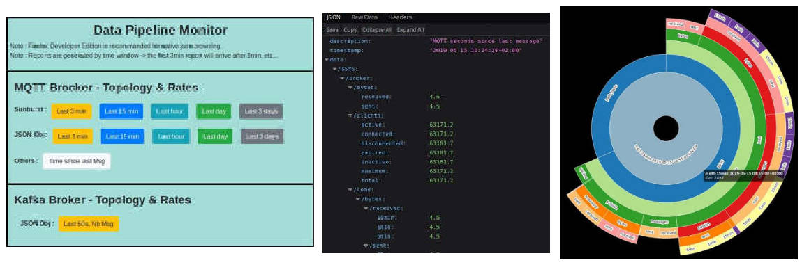
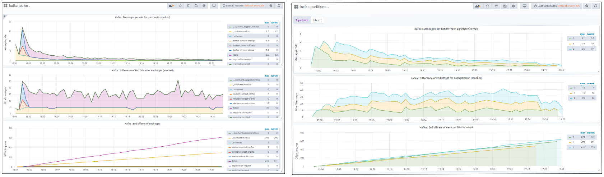
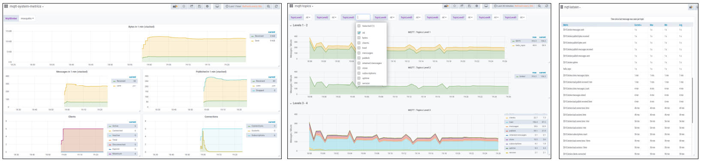

# Data Pipelines Monitor
This component monitors the behavior of MQTT & KAFKA brokers : rates of messages per topic + topology (for MQTT) and partitions (for KAFKA).

Charts & metrics are available live in Grafana & via a web server (json & sunburst).

_Note : Web reports and some metrics are generated over time (15 min, 1 hour..), won't be available immediately._

## Visualizations
#### Web Server - http://localhost:7575/


* Html / javascript portal
* Some metrics are available in JSON format
* Some MQTT topics (selection by filter in conf file) can be followed in detail with interactive sunburst charts (generated every 3 min, 15 min, etc.)     

#### Grafana for Kafka : http://localhost:3000/


* Dashboard **kafka-topics** : following activities at topic level = Nb of messages / min, Evolution of end offset for each topic.
* Dashboard **kafka-partitions** : live follow-up of partitions activities for the selected topic. 

#### Grafana for MQTT : http://localhost:3000/


* Dashboard **mqtt-system-metrics** : MQTT Broker is using its own $SYS topic (with subtopics) to report its performance metrics. The live values of these $SYS topics are collected and reported.
* Dashboard **mqtt-topics** : Hierarchical view of topics with filters, showing the Nb of messages / min from root to last branch.
* Dashboard **mqtt-lastseen** : During detailed monitoring, the duration in seconds since the last message of each topic is calculated.


## Components


* Web Server - http://localhost:7575/
    * Python Process using cherrypy lib
    * html/javascript with jquery & bootstrap
    * Sunburst charts based on d3js

* Kafka Listener
    * Python Process using kakfa client & Influx client
    * Regularly connects to kakfa, asking to be positionned on latest index of messages (do not maintain a continuous connexion)
    * Once connected, request list of topics, collect the latest indexes (offset of stream messages), compare and collect indexes of last messages for each partition
    * Disconnect from Kafka
    * Offsets and their variation over time is sent to InfluxDB 

* MQTT Listener
    * Python process subscribing to mqtt broker, here the connexion as subscriber is maitained
    * Collect the values of $SYS topics (MQTT self monitoring)
    * Allow detailed followup of some topics by **collecting all theirs messages**
    * The topics followed in detail are defined in conf file (the filters), topology and lastseen messages are hence available in viz
    * Carreful : detailed followup is useful for test & devel, not for production. 

* Grafana - http://localhost:3000/
    * Influxdb datasource is provisionned in Grafana (like Druid)
    * Dashboards for kafka & mqtt are also provisionned.

* Influx DB
    * To store metrics : unstructured, flexible, short term retention
    * 1 unique database is created in Influx for this monitoring : "datapipes" (done in compose file)
    * Several measurements are used (the equivalent of a table)
 
## Usage
The monitoring is integrated into the project composer :
```bash
./compose.sh up
./compose.sh down
```

To use the containers directly, create and run Docker image with connexion to the demo network.

For Influx (influxDB is normally launched in the compose file, the database "datapipes" is created at this moment) :
```bash
docker run -p8086:8086 --network demo_default influxdb
```
Then for the datapipes-monitor itself :
```bash 	
docker build -t datapipes-monitor ./datapipes-monitor/
docker run -ti -p7575:7575 --network demo_default --rm datapipes-monitor
```
    
## Notes

##### KAFKA listener
It is now connecting & disconnecting from Kafka. At the next connection, the client is positionned on the last offsets.

Another possibility is to stay connected and browse the partition offsets to regulary reposition the client on the last offset (to count them).   

##### MQTT Listener
Following topics in details (specified in the conf file), with all their subtopics means that all their messages are pushed to the listener.
Carreful not to specify too many topics, for performance reasons.  
